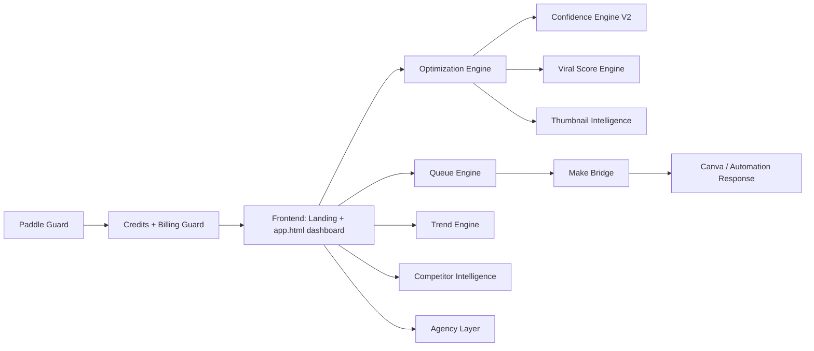

# ACOPES AI

AI Optimization Platform for Etsy Sellers.

ACOPES AI is a public beta SaaS platform for Etsy sellers. It provides conversion intelligence for listing SEO, CTR, thumbnail quality, rewrite modes, and draft-safe optimization review.

Live beta:

- Production: `https://acopesai.com`
- Local: `http://localhost:4173`

ACOPES AI helps sellers improve:

- SEO titles
- descriptions
- tags
- hero thumbnails
- image alt text
- Pinterest copy
- Etsy 2026 title compliance scoring
- AI confidence scoring

All Etsy listing changes remain **draft-only by default** until the seller approves them.

## Product Summary

ACOPES AI is a seller intelligence dashboard for Etsy optimization. It combines listing scoring, AI rewrite suggestions, thumbnail intelligence, competitor signals, trend detection, queue management, and credit-based beta usage into one draft-safe workflow.

The product is built for Etsy sellers who want stronger conversion decisions before manually approving listing changes.

## Key Features

- AI listing analysis for SEO, CTR, title clarity, tags, thumbnail quality, mobile readability, buyer intent, giftability, and competition pressure
- Draft-safe optimization workflow with `Approve Draft` language
- Competitor intelligence and buyer trend panels
- Viral potential, revenue impact, and thumbnail intelligence engines
- Optimization queue, retry controls, and history logs
- Free beta credits with Pro and Agency upgrade foundations
- Make/Canva automation bridge for optimization responses and thumbnail previews

## Tech Stack

- Node.js + Express backend
- Vanilla HTML, CSS, and JavaScript frontend
- JSON file storage in `data/` for beta sessions, users, queues, listings, and logs
- Make.com webhook bridge
- Canva export response support through `thumbnail_preview_url`
- Vercel-ready environment configuration

## Beta Status

ACOPES AI is live as a public beta at `https://acopesai.com`.

Current status:

- Public landing page: ready
- Dashboard: ready
- Credits and onboarding: ready
- Make/Canva bridge: ready
- Paddle: test-only foundation
- Etsy live publishing: draft-safe boundary only
- Screenshots: placeholder checklist ready, final launch images still needed

## Security Note

Do not commit local secrets.

- `.env` is ignored by `.gitignore`
- Use `.env.example` for placeholder configuration only
- Store `MAKE_WEBHOOK_URL` in Vercel environment variables for production
- Keep `data/` out of public repos because it can contain beta users, sessions, queues, and logs
- Rotate any webhook or API secret immediately if it is accidentally committed

## Public Beta

- First `15` optimization credits free
- Email-based user accounts remembered with a browser session cookie
- Credit-based usage tracking
- Draft-safe optimization workflow
- Batch queue and retry flow
- Optimization history and scoring
- Before/after thumbnail preview
- Broken image fallback with an ACOPES AI placeholder
- Public waitlist capture before paid launch

## V4 Public Beta Launch Status

The project is currently prepared as a polished public beta SaaS experience.

- Landing page: ACOPES AI public beta hero, live demo CTA, how-it-works flow, thumbnail comparison, social proof, testimonials, FAQ, legal footer, and waitlist capture.
- Dashboard: luxury SaaS console with product cards, live optimization cards, queue, logs, history, sticky draft status, rewrite modes, competitor snapshot, SEO risk detector, and thumbnail score breakdown.
- Pricing: Free, Pro, and Agency cards are visible. Pro is highlighted. Paid billing is still simulated through the Paddle test endpoint.
- FAQ: draft-safe publishing, SEO tool positioning, thumbnail optimization, and beta Etsy API access are explained.
- Credits: email-based users get `15` free credits, `pro` test upgrades grant `100`, and `agency` test upgrades grant `500`.
- Paddle test flow: `POST /api/paddle-webhook-test` works in development and is disabled when `NODE_ENV=production`.
- Make/Canva automation flow: `/api/send`, `/api/send-batch`, Make webhook delivery, `/api/make-response`, Canva thumbnail preview URLs, logs, retries, and optimization history remain supported.
- Product integration: `Start Free Beta`, `View Live Demo`, and pricing upgrade CTAs route sellers into `/app.html`; dashboard onboarding uses `/api/session` and `/api/onboarding`.
- Legal placeholders: `/privacy.html` and `/terms.html` exist for launch review.

## V7 Production Intelligence Layer

ACOPES AI now includes a production intelligence layer that moves the dashboard beyond a simple demo optimizer.

- Landing: public SaaS shell at `https://acopesai.com` with beta CTAs into `/app.html`.
- Dashboard: seller operating system layout with KPI cards, listing analysis, recommendations, queue visualization, history, draft preview, and locked upgrade psychology.
- Optimization engine: scores SEO, CTR, thumbnail quality, tag relevance, mobile readability, Etsy keyword positioning, buyer intent, giftability, and competition pressure.
- Queue engine: visualizes `queued`, `processing`, `optimized`, and `failed` states with live badges and retry controls.
- Credits: free/pro/agency credit accounting remains session-based and draft-safe.
- Confidence engine: V2 weighted formula uses SEO `25%`, CTR `25%`, thumbnail `20%`, tags `15%`, mobile readability `5%`, buyer intent `5%`, and competition `5%`.
- Fake analytics: deterministic estimates for views/day, favorites/day, conversion estimate, and revenue estimate based on listing title, listing id, and scores.
- Make bridge: `/api/send`, `/api/send-batch`, and `/api/make-response` remain the automation path; missing `MAKE_WEBHOOK_URL` returns a clear error.
- Paddle guard: test upgrade endpoint remains available in development and disabled in production.
- API envelope: responses now include `success`, `message`, `data`, and `error` while preserving legacy top-level fields where the dashboard needs them.

## V8 Commerce Intelligence Layer

V8 adds commerce intelligence systems for market, trend, viral, thumbnail, revenue, and agency workflows.



- Competitor intelligence: accepts a keyword or Etsy listing URL and returns simulated market data for title length, keyword density, tag overlap, pricing clusters, reviews, favorites, listing age, shipping, personalization, and thumbnail style.
- Viral score engine: scores emotional keywords, giftability, CTR strength, trend fit, thumbnail contrast, social-share potential, and personalization potential.
- Trend engine: renders buyer-intent trends such as coquette jewelry, old money necklace, minimalist gold bracelet, dainty pearl gift, and quiet luxury jewelry.
- Bulk optimization engine: Pro/Agency foundation with bulk queue, approve, retry, and locked free-user UI.
- Thumbnail intelligence: brightness, contrast, visibility, mobile readability, clutter, luxury aesthetic, and Etsy CTR prediction.
- Revenue engine: estimates CTR uplift, conversion uplift, favorites growth, and potential monthly revenue impact.
- AI action center: highlights critical, medium, and low severity listing issues.
- Live activity feed: seller operating-system activity stream for optimization, queue, confidence, credits, and onboarding events.
- API hardening V2: responses include timestamps, request IDs, and retry-safe flags.

## V9 Etsy Live Listing Sync

V9 adds a production-safe Etsy OAuth connection layer while preserving draft-safe behavior.

- OAuth 2.0 PKCE flow through `GET /api/etsy/connect` and `GET /api/etsy/callback`
- Etsy auth status card in the dashboard
- Manual refresh sync button for live seller listings
- Token expiration detection and refresh-token handling
- Reconnect/disconnect Etsy flow
- Live listing cache stored in `data/listings.json`
- Backward-compatible fallback to the previous public/cache listing flow
- No live publishing or Etsy write mutation is performed

Required Etsy environment variables:

```text
ETSY_CLIENT_ID=your_etsy_keystring_here
ETSY_REDIRECT_URI=https://your-domain.com/api/etsy/callback
ETSY_SCOPES=listings_r shops_r
```

Local callback:

```text
http://localhost:4173/api/etsy/callback
```

## Launch Assets

Launch docs are prepared in `docs/launch/`:

- `docs/launch/producthunt.md`
- `docs/launch/reddit.md`
- `docs/launch/twitter-thread.md`
- `docs/launch/production-checklist.md`

Screenshot planning is prepared in `docs/screenshots/README.md`.

## Roadmap

- Real Paddle checkout and signed webhook verification
- Authenticated Etsy API executor for approved draft updates
- Real competitor crawler with marketplace-safe rate limits
- Persistent database migration from JSON files
- User workspace/team support for agencies
- Production analytics and error monitoring

## Known Limitations

- The beta uses JSON file storage instead of a production database.
- Competitor intelligence is simulated until the real marketplace crawler is connected.
- Etsy listing updates remain draft-safe and require an authenticated executor before live publishing.
- Paddle billing is not live; development test webhook only simulates plan upgrades.
- No sales uplift is guaranteed.

## Launch Links

- Live beta: `https://acopesai.com`
- Product Hunt kit: `docs/launch/producthunt.md`
- Reddit founder drafts: `docs/launch/reddit.md`
- X/Twitter launch thread: `docs/launch/twitter-thread.md`
- Screenshot checklist: `docs/screenshots/README.md`
- Production checklist: `docs/launch/production-checklist.md`

## Demo Screenshots

Screenshot folder is prepared at `docs/screenshots/`.

Add screenshots before launch:

1. `docs/screenshots/landing-page.png`
2. `docs/screenshots/dashboard.png`
3. `docs/screenshots/optimization-card.png`
4. `docs/screenshots/pricing-faq.png`

Suggested captions:

- Public beta landing page
- Live optimization dashboard
- Before/after optimization review card

## Features

| Feature | Free Beta | Pro |
| --- | --- | --- |
| Optimizations | 15 credits | 100 credits |
| Etsy draft-only safety | Yes | Yes |
| Batch queue | Basic | Advanced |
| Optimization history | Yes | Yes |
| Hero thumbnail CTR scoring | Yes | Yes |
| AI confidence score | Yes | Yes |
| Etsy 2026 title guidance | Yes | Yes |
| Before/after thumbnail preview | Yes | Yes |
| Priority testing | No | Yes |

Plans supported in V1:

- `free`: 15 credits for new users
- `pro`: 100 credits through the test billing webhook
- `agency`: 500 credits through the test billing webhook

## Run Locally

```powershell
npm.cmd install
npm.cmd run dev
```

Open:

- Production landing: `https://acopesai.com`
- Landing page: `http://localhost:4173`
- App dashboard: `http://localhost:4173/app.html`
- Privacy placeholder: `http://localhost:4173/privacy.html`
- Terms placeholder: `http://localhost:4173/terms.html`

## Core Beta Flow

1. Visitor lands on the public page.
2. Visitor joins the beta waitlist or opens the dashboard.
3. Session is created automatically and remembered by cookie.
4. Seller completes lightweight email onboarding.
5. A user record is created in `data/users.json` with `15` free credits.
6. Product is sent to Make.com.
7. One credit is consumed for each optimization request.
8. Make returns optimized JSON to `/api/make-response`.
9. Dashboard updates the matching card by `listing_id`.
10. Seller reviews before/after copy and thumbnail previews.
11. Seller clicks `Approve Draft`; the app does not auto-publish Etsy listings.

## Etsy 2026 Title Guidance

The optimizer now scores titles against a cleaner 2026 Etsy-style title pattern:

- Keep titles short, clear, and roughly under `15` words.
- Put the primary buyer keyword and product type first.
- Avoid repeating gift phrases in the title.
- Move terms such as `gift for her`, `birthday gift`, `bridesmaid jewelry`, and `quiet luxury gift` into tags, descriptions, or attributes.

Preferred title style:

```text
Gold Box Chain Necklace, Minimal Layering Jewelry
```

Old spam-style titles with repeated gift phrases or too many separators receive a lower title compliance and confidence score.

## V2 Dashboard Features

- `Confidence` KPI added to the dashboard.
- Each optimization record gets a `confidence_score` from `0-100`.
- Confidence combines title clarity, tag quality, thumbnail score, Etsy 2026 title compliance, and description quality.
- Optimization cards show `Why AI changed this` with concise reasoning.
- Cards show before image and after `thumbnail_preview_url` side by side.
- If Canva preview is not ready, the card shows `Canva preview pending`.
- Broken Etsy or Canva images are replaced with a soft ivory ACOPES AI placeholder.
- Public beta approval language is draft-safe: `Approve Draft`, not publish.

## Main API Endpoints

```text
GET  /api/session
POST /api/onboarding
POST /api/waitlist
GET  /api/analytics
GET  /api/listings
GET  /api/etsy/status
GET  /api/etsy/connect
GET  /api/etsy/callback
POST /api/etsy/sync
POST /api/etsy/disconnect
GET  /api/optimizations
GET  /api/queue
POST /api/send
POST /api/send-batch
POST /api/make-response
POST /api/test-make-response
POST /api/paddle-webhook-test
```

## User And Credit API

`GET /api/session` returns the current browser session plus user account summary:

```json
{
  "email": "seller@example.com",
  "current_plan": "free",
  "credits_remaining": 15,
  "credits_granted": 15,
  "limit_reached": false
}
```

`POST /api/onboarding` creates or reconnects an email user:

```json
{
  "store_name": "Example Etsy Shop",
  "email": "seller@example.com"
}
```

Optimization endpoints require an onboarded email user:

- `POST /api/send` consumes `1` credit.
- `POST /api/send-batch` consumes `1` credit per listing.
- `POST /api/retry/:id` consumes `1` credit.

If credits are depleted, the API returns `402` with `error: "credits_depleted"` and the dashboard opens the upgrade modal.

## Paddle Test Webhook

Real Paddle billing is not connected in the public beta. Use the local test endpoint to simulate a paid upgrade:

```bash
curl -X POST http://localhost:4173/api/paddle-webhook-test \
  -H "Content-Type: application/json" \
  -d '{"email":"seller@example.com","plan":"pro"}'
```

Accepted plans:

- `pro`: sets the user plan to `pro` and grants `100` credits
- `agency`: sets the user plan to `agency` and grants `500` credits

In production mode, this test endpoint returns `404`:

```text
NODE_ENV=production
POST /api/paddle-webhook-test -> 404 disabled_in_production
```

## Make Response Bridge

Make should send a JSON `POST` request to:

```text
http://localhost:4173/api/make-response
```

Accepted payload:

```json
{
  "listing_id": "4362680734",
  "seo_title": "AI optimized title",
  "description": "AI description",
  "tags": ["tag1", "tag2"],
  "alt_text": "AI alt text",
  "thumbnail_preview_url": "https://...",
  "seo_score": 90,
  "ctr_score": 95,
  "thumbnail_score": 92,
  "tag_score": 90,
  "alt_text_score": 95,
  "status": "completed"
}
```

The server also computes:

- `etsy_2026_title_score`
- `description_quality_score`
- `mobile_readability_score`
- `buyer_intent_score`
- `competition_score`
- `confidence_score`
- `ai_change_reasons`

## Local Test

```bash
curl -X POST http://localhost:4173/api/make-response \
  -H "Content-Type: application/json" \
  -d '{"listing_id":"4362680734","seo_title":"AI optimized title","description":"AI description","tags":["tag1","tag2"],"alt_text":"AI alt text","thumbnail_preview_url":"https://example.com/thumb.jpg","seo_score":90,"ctr_score":95,"thumbnail_score":92,"tag_score":90,"alt_text_score":95,"status":"completed"}'
```

The dashboard also includes a `Test Make Response` button.

## Data Files

- `data/listings.json`
- `data/etsy-tokens.json`
- `data/etsy-listings.json` legacy fallback cache
- `data/optimization-history.json`
- `data/optimization-queue.json`
- `data/automation-logs.json`
- `data/sessions.json`
- `data/users.json`
- `data/waitlist.json`
- `data/analytics.json`

## Etsy Execution Boundary

The app prepares draft-safe Etsy changes, but live Etsy mutations still require an authenticated Etsy executor or Etsy API connection for:

- title updates
- description updates
- tag replacement
- hero image upload
- image alt-text update

Approved records are marked `awaiting_authenticated_etsy_executor` instead of being auto-published.

## Production Deploy Checklist

- Set environment variables:
  - `MAKE_WEBHOOK_URL`
  - `MAKE_RESPONSE_SECRET`
  - `PORT`
  - `NODE_ENV=production`
- Confirm `.env.example` is copied into the deploy environment with real values.
- Confirm Vercel production env includes `MAKE_WEBHOOK_URL`.
- Confirm Vercel production env includes `MAKE_RESPONSE_SECRET`.
- Confirm live domain resolves: `https://acopesai.com`.
- Verify Make.com callback points to the deployed HTTPS `/api/make-response` endpoint.
- Verify Make.com sends `X-ACOPES-WEBHOOK-SECRET` with the same value as `MAKE_RESPONSE_SECRET`.
- Verify Canva export responses include `thumbnail_preview_url`.
- Verify landing CTAs route to `/app.html`.
- Verify onboarding creates a remembered session cookie and grants `15` free credits.
- Replace Paddle test flow with real Paddle webhook integration. TODO.
- Review `/privacy.html` with legal/privacy guidance before launch. TODO.
- Review `/terms.html` with legal guidance before launch. TODO.
- Connect production domain and HTTPS. TODO.
- Add launch screenshots to `docs/screenshots/`. TODO.
- Run smoke tests:
  - `GET /`
  - `GET /app.html`
  - `GET /privacy.html`
  - `GET /terms.html`
  - `GET /api/session`
  - `POST /api/test-make-response`

## Vercel Serverless Notes

- `server.js` exports the Express app for Vercel serverless deployment.
- Local development still runs `app.listen()` through `npm.cmd run dev`.
- Runtime JSON writes use `/tmp/acopes-ai` by default, not the read-only Vercel project directory.
- Seed/demo data can still be read from the repository `data/` folder.
- Persistent production storage should move to a database before paid launch because `/tmp` is ephemeral in serverless environments.
- `/api/make-response` remains available as the Make callback route on Vercel.
- `/api/make-response` requires `X-ACOPES-WEBHOOK-SECRET` when `MAKE_RESPONSE_SECRET` is set.

## Beta Goal

Launch publicly, gather seller feedback, validate conversion value, then introduce paid Pro features after product-market signal is clear.
